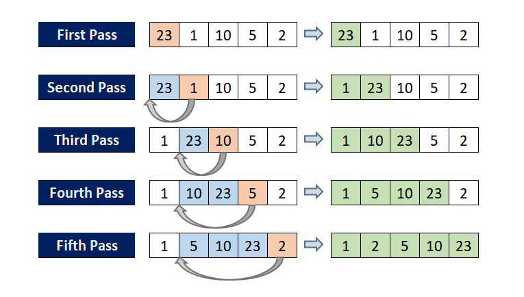
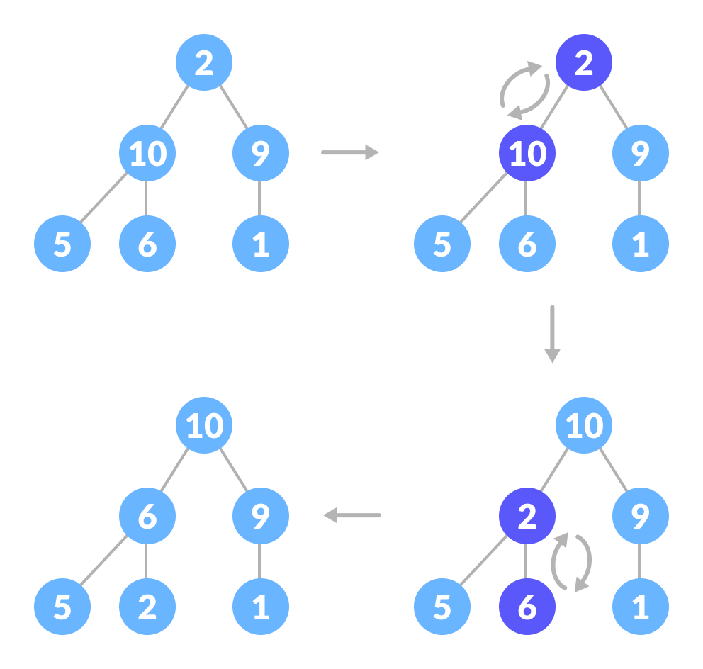

# Sorting Algorithm

## Description
This project explores sorting algorithms with both terminal and graphical interfaces. It provides a hands-on approach to visualize and analyze the performance of various sorting algorithms in both graphical and textual forms.

## Features
- Implements popular sorting algorithms like selection, bubble, insertion, merge, quick, heap, and comb sort.
- Terminal interface for detailed performance analysis (execution time, comparisons, etc.).
- Graphical interface using pygame for an interactive, visual understanding of sorting processes.
- Comparative analysis and graphical representation of different algorithms' efficiency using matplotlib.

## Sorting Algorithms
### Selection Sort
```
def selection_sort(arr, ascending=True): 
    n = len(arr)
    for i in range(n):
        extrema_index = i
        for j in range(i + 1, n):
            if (ascending and arr[j] < arr[extrema_index]) or (not ascending and arr[j] > arr[extrema_index]):
                extrema_index = j
        arr[i], arr[extrema_index] = arr[extrema_index], arr[i]
    return arr

```


The function `selection_sort` takes two parameters: `arr`, which is the list to be sorted, and `ascending`, a boolean value that determines whether the list should be sorted in ascending order (default is `True`).


The variable `n` is assigned the length of the list `arr`.


The outer loop (`for i in range(n)`) iterates over each element in the list. For each iteration, it assumes the current index `i` is the index of the smallest (for ascending sort) or largest (for descending sort) element. This is the “selection” part of the algorithm.


The inner loop (`for j in range(i + 1, n)`) starts from the next element and compares each element with the element at the `extrema_index`. If it finds a smaller (for ascending sort) or larger (for descending sort) element, it updates `extrema_index` to the current index `j`.


After the inner loop finishes, the algorithm knows the index of the smallest (or largest) element in the unsorted part of the list. It then swaps the element at `extrema_index` with the element at the current index `i`.


This process repeats until the entire list is sorted.


Finally, the sorted list `arr` is returned.


The time complexity of this algorithm is `O(n2)`
, where `n` is the number of elements in the list. This is because for each element, the algorithm performs a linear scan to find the smallest (or largest) element in the unsorted part of the list. Despite its simplicity, selection sort is generally not suitable for large datasets due to its quadratic time complexity. 

However, it has the advantage of performing `O(n)`
 swaps in worst-case scenarios, which can be useful in situations where write operations are costly.
### Bubble Sort
```
def bubble_sort(arr, ascending=True): 
    n = len(arr)
    for i in range(n):
        for j in range(0, n - i - 1):
            if (ascending and arr[j] > arr[j + 1]) or (not ascending and arr[j] < arr[j + 1]):
                arr[j], arr[j + 1] = arr[j + 1], arr[j]
    return arr
```


The function `bubble_sort` takes two parameters: `arr`, which is the list to be sorted, and `ascending`, a boolean value that determines whether the list should be sorted in ascending order (default is `True`).


The variable `n` is assigned the length of the list `arr`.


The outer loop (`for i in range(n)`) iterates over each element in the list.


The inner loop (`for j in range(0, n - i - 1)`) compares each pair of adjacent elements. If the elements are in the wrong order (greater than for ascending sort or less than for descending sort), it swaps them.


This process repeats until the entire list is sorted. With each iteration of the outer loop, the largest (for ascending sort) or smallest (for descending sort) element “bubbles up” to its correct position, hence the name “Bubble Sort”.


Finally, the sorted list `arr` is returned.


The time complexity of this algorithm is `O(n2)`
, where `n`
 is the number of elements in the list. This is because for each element, the algorithm performs a linear scan to bubble the largest (or smallest) element to its correct position. 
 
 The space complexity is `O(1)`
, which means it sorts the list in-place without needing additional storage. Despite its simplicity, bubble sort is generally not suitable for large datasets due to its quadratic time complexity. 

However, it has the advantage of being easy to understand and implement. It also has the property of being a stable sort, which means it maintains the relative order of equal sort elements.

### Insertion Sort
```
def insertion_sort(arr, ascending=True):
    n = len(arr)
    for i in range(1, n):
        key = arr[i]
        j = i - 1
        while j >= 0 and ((ascending and key < arr[j]) or (not ascending and key > arr[j])):
            arr[j + 1] = arr[j]
            j -= 1
        arr[j + 1] = key
    return arr
```


The function `insertion_sort` takes two parameters: `arr`, which is the list to be sorted, and `ascending`, a boolean value that determines whether the list should be sorted in ascending order (default is `True`).


The variable `n` is assigned the length of the list `arr`.


The outer loop (`for i in range(1, n)`) iterates over each element in the list, starting from the second element. This is because the algorithm assumes the first element is already sorted.


The `key` variable is assigned the value of the current element. This is the element that the algorithm attempts to insert into the sorted portion of the list.


The `j` variable is assigned the index of the previous element.


The while loop (`while j >= 0 and ((ascending and key < arr[j]) or (not ascending and key > arr[j]))`) shifts elements of the sorted portion that are greater (for ascending sort) or smaller (for descending sort) than `key` to the right.


Once the correct position for `key` is found (or when `j` becomes `-1`),`key` is inserted.


This process repeats until the entire list is sorted.


Finally, the sorted list `arr` is returned.


The time complexity of this algorithm is `O(n2)`
, where n
 is the number of elements in the list. This is because for each element, the algorithm may have to shift all the previously sorted elements. 
 
 The space complexity is `O(1)`
, which means it sorts the list in-place without needing additional storage. Insertion sort is efficient for small lists or for lists that are already partially sorted, and it is also stable, which means it maintains the relative order of equal sort elements. 

However, like bubble sort and selection sort, it is not suitable for large datasets due to its quadratic time complexity.


### Merge Sort
```
def merge_sort(arr, ascending=True): 
    if len(arr) > 1:
        mid = len(arr) // 2
        L = arr[:mid]
        R = arr[mid:]
        merge_sort(L, ascending)
        merge_sort(R, ascending)
        i = j = k = 0
        while i < len(L) and j < len(R):
            if (ascending and L[i] < R[j]) or (not ascending and L[i] > R[j]):
                arr[k] = L[i]
                i += 1
            else:
                arr[k] = R[j]
                j += 1
            k += 1
        while i < len(L):
            arr[k] = L[i]
            i += 1
            k += 1
        while j < len(R):
            arr[k] = R[j]
            j += 1
            k += 1
    return arr
```


The function `merge_sort` takes two parameters: `arr`, which is the list to be sorted, and `ascending`, a boolean value that determines whether the list should be sorted in ascending order (default is `True`).


If the list `arr` has more than one element, the function proceeds with the sorting process. If the list has one or no elements, it is already sorted and is returned as is.


The list is divided into two halves. The `mid` variable is calculated as the floor division of the length of the list by 2. The lists `L` and `R` are created as the first half and the second half of the list `arr`, respectively.


The function calls itself recursively to sort the two halves, `L` and `R`.


Once the two halves are sorted, the function merges them. It initializes three pointers `i`, `j`, and `k` to 0. These pointers represent the current index of `L`, `R`, and `arr`, respectively.


The function enters a loop that continues until it has gone through all the elements of `L` and `R`. In each iteration, it compares the current elements of `L` and `R`. The smaller (or larger, for descending sort) of the two is put into `arr` and the corresponding pointer is incremented. The pointer `k` is also incremented.


If there are remaining elements in `L` or `R` after one of the lists is exhausted, these elements are copied to `arr`.


Finally, the sorted list `arr` is returned.


The time complexity of this algorithm is `O(nlogn)`
, where n
 is the number of elements in the list. This is because the algorithm divides the list in half with each recursive call, and then merges the halves in linear time. 
 
 The space complexity is `O(n)`
, which is needed for the temporary arrays used during the merge process. 

Merge sort is efficient and suitable for large datasets, but it requires more space than the in-place sorting algorithms like bubble sort, selection sort, and insertion sort. It is also a stable sort, which means it maintains the relative order of equal sort elements.


### Quick Sort
```
def quick_sort(arr, ascending=True):
    if len(arr) <= 1:
        return arr
    pivot = arr[len(arr) // 2]
    left = [x for x in arr if (ascending and x < pivot) or (not ascending and x > pivot)]
    middle = [x for x in arr if x == pivot]
    right = [x for x in arr if (ascending and x > pivot) or (not ascending and x < pivot)] 
    return quick_sort(left, ascending) + middle + quick_sort(right, ascending)

```


The function `quick_sort` takes two parameters: `arr`, which is the list to be sorted, and `ascending`, a boolean value that determines whether the list should be sorted in ascending order (default is `True`).


If the list `arr` has one or no elements, it is already sorted and is returned as is.


The `pivot` is chosen as the element at the middle index of the list. The choice of pivot can vary, but in this implementation, it’s the middle element.


The list is partitioned into three parts:

1. `left` contains elements that are less than (for ascending sort) or greater than (for descending sort) the pivot.
2. `middle` contains elements that are equal to the pivot.
3. `right` contains elements that are greater than (for ascending sort) or less than (for descending sort) the pivot.


The function calls itself recursively to sort the `left` and `right` partitions.


Finally, the sorted `left` partition, the `middle` partition, and the sorted `right` partition are concatenated to produce the sorted list, which is returned.


The time complexity of this algorithm is `O(nlogn)`
 in the average case and `O(n2)`
 in the worst case, where `n`
 is the number of elements in the list. The worst case occurs when the smallest or largest element is always chosen as the pivot, resulting in an unbalanced partition. 
 
 The space complexity is `O(logn)`
 due to the recursive stack, assuming a balanced partition. Quick sort is generally faster in practice than other `O(nlogn)`
 algorithms like merge sort and heap sort, and it sorts the list in-place, requiring only a small auxiliary stack. 
 
 However, it is not a stable sort, which means it does not maintain the relative order of equal sort elements.

### Heap Sort
```
def heap_sort(arr, ascending=True):
    def heapify(arr, n, i):
        largest = i
        l = 2 * i + 1
        r = 2 * i + 2
        if l < n and ((ascending and arr[i] < arr[l]) or (not ascending and arr[i] > arr[l])):
            largest = l
        if r < n and ((ascending and arr[largest] < arr[r]) or (not ascending and arr[largest] > arr[r])):
            largest = r
        if largest != i:
            arr[i], arr[largest] = arr[largest], arr[i]
            heapify(arr, n, largest)

    n = len(arr)
    for i in range(n // 2 - 1, -1, -1):
        heapify(arr, n, i)
    for i in range(n - 1, 0, -1):
        arr[i], arr[0] = arr[0], arr[i]
        heapify(arr, i, 0)
    return arr
```


The function `heap_sort` takes two parameters: `arr`, which is the list to be sorted, and `ascending`, a boolean value that determines whether the list should be sorted in ascending order (default is `True`).


The function `heapify` is a helper function that maintains the heap property. For a particular node `i`, `l` is its left child and `r` is its right child. If the current node’s value is less than its child node (for ascending sort) or greater than its child node (for descending sort), it swaps the values and recursively calls `heapify` for the affected subtree.


The variable `n` is assigned the length of the list `arr`.


The function first builds a heap from the input list. It starts from the last non-leaf node (given by `n // 2 - 1`) and applies `heapify` to each node up to the root node.


Once the heap is built, the function swaps the root of the heap with the last node, decreases the size of the heap by one, and applies `heapify` to the new root node. This process is repeated until all nodes have been extracted from the heap.


Finally, the sorted list `arr` is returned.


The time complexity of this algorithm is `O(nlogn)`
, where `n`
 is the number of elements in the list. This is because the algorithm builds a heap in `O(n)`
 time and then makes `n`
 extractions from the heap, each costing `O(logn)`
 time. 
 
 The space complexity is `O(1)`
, which means it sorts the list in-place without needing additional storage. Heap sort is efficient and suitable for large datasets, and it has the advantage of achieving the optimal `O(nlogn)`
 time complexity in the worst case, unlike quick sort. 
 
 However, it is not a stable sort, which means it does not maintain the relative order of equal sort elements.


### Comb Sort
```
def comb_sort(arr, ascending=True):
    n = len(arr)
    gap = n
    shrink = 1.3
    swapped = True
    while gap > 1 or swapped:
        gap = int(gap / shrink)
        if gap < 1:
            gap = 1
        swapped = False
        for i in range(n - gap):
            if (ascending and arr[i] > arr[i + gap]) or (not ascending and arr[i] < arr[i + gap]):
                arr[i], arr[i + gap] = arr[i + gap], arr[i]
                swapped = True
    return arr
```


The function `comb_sort` takes two parameters: `arr`, which is the list to be sorted, and `ascending`, a boolean value that determines whether the list should be sorted in ascending order (default is `True`).


The variable `n` is assigned the length of the list `arr`.


The `gap` variable is initially set to `n`. This is the distance between elements being compared during the sorting process.


The `shrink` factor is set to 1.3, which is a common value used to decrease the `gap` with each iteration. The value 1.3 has been empirically found to work well in practice.


The `swapped` variable is a flag that indicates whether a swap has occurred in the inner loop.


The outer loop continues until `gap` is greater than 1 or a swap has occurred. If `gap` is less than 1, it is set to 1 to ensure that the algorithm compares each pair of adjacent elements at least once.


The inner loop (`for i in range(n - gap)`) compares each pair of elements that are `gap` distance apart. If the elements are in the wrong order (greater than for ascending sort or less than for descending sort), it swaps them and sets `swapped` to `True`.


Finally, the sorted list `arr` is returned.


The time complexity of this algorithm is `O(n2)`
 in the worst case, where `n`
 is the number of elements in the list. However, it tends to perform better than `O(n2)`
 in practice, especially for larger lists, due to the shrinking gap size. 
 
 The space complexity is `O(1)`
, which means it sorts the list in-place without needing additional storage. Comb sort improves on bubble sort by comparing elements separated by a gap of several positions, which allows it to eliminate ‘turtles’, or small values near the end of the list, which are a problem in bubble sort. 

However, like bubble sort, it is not a stable sort, which means it does not maintain the relative order of equal sort elements.

## Installation
You'll need Python along with matplotlib and pygame libraries.

```bash
pip install matplotlib pygame
```

## Usage
The `main.py` serves as the entry point to choose between the graphical and terminal interfaces:

```bash
python main.py
```

- For the terminal interface: Choose to run `terminal_interface.py` for analysis and comparisons.
- For the graphical interface: Choose to run `graphical_interface.py` for a visual representation of sorting algorithms.

## Project Structure
- `main.py`: Entry point to select the preferred interface.
- `sorting.py`: Contains implementations of various sorting algorithms.
- `terminal_interface.py`: Provides terminal-based analysis and comparisons of algorithms.
- `graphical_interface.py`: Offers a GUI for interactive visualization of sorting.

## Contributing
Feel free to contribute!

## License
Erika, Pierre, Sabrenne
